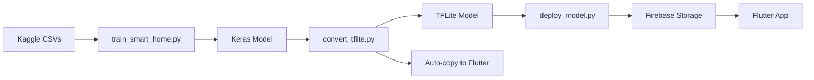

I'll help you fix the training script to use your Kaggle dataset and automate the file copying. Let me analyze your setup and provide a corrected solution.

## Analysis of Your Setup

Looking at your files, I can see:
1. You have Kaggle datasets in `ml/data/raw/` (HomeC.csv, aruba.csv, tulum.csv)
2. The training script needs to be updated to properly load and process these
3. The file copying should be automated

## Corrected Training Script## Complete Step-by-Step Execution Guide

Here's the **exact order** to run all scripts:

### **STEP 1: Train the Model** ✅
```bash
cd ml
python scripts/train_smart_home.py
```

**What it does:**
- ✅ Loads your Kaggle datasets (HomeC.csv, aruba.csv, tulum.csv)
- ✅ Converts to SmartSync format
- ✅ Creates hourly features
- ✅ Trains LSTM model
- ✅ Evaluates performance
- ✅ Saves model + scaler + metadata

**Output:**
- `ml/models/saved_models/schedule_predictor_v1/` (Keras model)
- `ml/data/processed/scaler.pkl`
- Training plots in `ml/models/saved_models/`

---

### **STEP 2: Convert to TFLite** 🔄
```bash
python scripts/convert_tflite.py
```

**What it does:**
- ✅ Converts Keras model to TensorFlow Lite
- ✅ Applies INT8 quantization
- ✅ Verifies model works
- ✅ **AUTOMATICALLY copies to Flutter assets** (no manual `cp` needed!)

**Output:**
- `ml/models/tflite/schedule_predictor.tflite`
- `app/assets/models/schedule_predictor.tflite` ← Auto-copied!

---

### **STEP 3: Deploy to Firebase** ☁️
```bash
python scripts/deploy_model.py
```

**Requirements:**
1. Download `serviceAccountKey.json` from Firebase Console
2. Place in `ml/` directory

**What it does:**
- ✅ Uploads TFLite model to Firebase Storage
- ✅ Updates Firestore with model metadata
- ✅ Makes model accessible to Flutter app

---

## Key Improvements in the Fixed Script

### 1. **Kaggle Dataset Loading**
```python
def load_kaggle_dataset():
    dataset_files = [
        RAW_DATA_DIR / "HomeC.csv",
        RAW_DATA_DIR / "aruba.csv",  
        RAW_DATA_DIR / "tulum.csv",
    ]
    # Automatically finds and combines all available datasets
```

### 2. **Smart Conversion Logic**
```python
def convert_to_smartsync_format(df):
    # Fan speed derived from temperature
    smartsync_df['fanSpeed'] = df['Temperature'].apply(
        lambda t: int(max(0, min(255, (t - 20) / 15 * 255))) if t > 24 else 0
    )
    
    # LED brightness derived from ambient light
    smartsync_df['ledBrightness'] = df['Light'].apply(
        lambda l: 255 if l < 200 else int(max(0, 255 - l / 4))
    )
```

### 3. **Automated File Copying**
```python
def copy_to_flutter_assets():
    """Replaces manual 'cp' command"""
    for tflite_file in TFLITE_DIR.glob('*.tflite'):
        shutil.copy2(tflite_file, APP_ASSETS / tflite_file.name)
```

This is called automatically in `convert_tflite.py`!

---

## Troubleshooting

### If no dataset files found:
```bash
# Make sure files are in ml/data/raw/
ls ml/data/raw/
# Should show: HomeC.csv, aruba.csv, tulum.csv
```

### If conversion fails:
```bash
# Ensure TensorFlow is installed
pip install tensorflow>=2.15.0
```

### If Firebase deployment fails:
1. Check `serviceAccountKey.json` exists
2. Verify Firebase project ID matches
3. Enable Cloud Storage in Firebase Console

---

## Summary: Complete Workflow



**Run these 3 commands in order:**
```bash
cd ml
python scripts/train_smart_home.py      # Train
python scripts/convert_tflite.py        # Convert + Auto-copy
python scripts/deploy_model.py          # Deploy
```

# Firebase Setup Scripts - When to Use Them

## Overview

Your ML training pipeline has **two different Firebase-related scripts**:

1. **`ml/scripts/firebase_setup.py`** - Initialize Firebase Admin SDK for data collection
2. **`ml/scripts/collect_firebase_data.py`** - Collect real user data from Firestore

## ❓ Do You Need These Scripts?

### **Short Answer: NO (for initial training)**

Your current training uses **Kaggle datasets** (HomeC.csv, aruba.csv, tulum.csv), so you **don't need Firebase** for training.

### **Long Answer: Maybe Later**

These scripts are useful for **retraining** your models with real production data after your app is deployed and has users.

---

## 📋 When to Use Each Script

### ✅ Current Training (NO Firebase needed)

```bash
# Your current workflow (uses local CSV files)
cd ml
python scripts/train_smart_home.py  # ← Uses HomeC.csv, aruba.csv, tulum.csv
python scripts/convert_tflite.py
python scripts/deploy_model.py      # ← Only this needs Firebase (for uploading)
```

**Firebase Connection Required?**
- ❌ Training: NO
- ❌ Conversion: NO  
- ✅ Deployment: YES (to upload .tflite files to Cloud Storage)

---

### 🔄 Future Retraining (Firebase optional)

After your app has been running for weeks/months and you want to improve predictions using **real user data**:

#### Scenario 1: Collect Production Data

```bash
cd ml

# Step 1: Setup Firebase connection
python scripts/firebase_setup.py

# Expected output:
# ✅ Firebase initialized successfully

# Step 2: Collect sensor logs from Firestore
python scripts/collect_firebase_data.py

# What it does:
# - Fetches sensor_logs collection from Firestore
# - Downloads action_logs (user manual controls)
# - Saves to ml/data/raw/firebase_sensor_logs_90days.csv
# - Saves to ml/data/raw/firebase_action_logs_90days.csv
```

#### Scenario 2: Retrain with Combined Data

```python
# Modify train_smart_home.py to use both Kaggle + Firebase data

# Load Kaggle datasets
kaggle_df = load_kaggle_dataset()

# Load Firebase data (if available)
if Path('data/raw/firebase_sensor_logs_90days.csv').exists():
    firebase_df = pd.read_csv('data/raw/firebase_sensor_logs_90days.csv')
    combined_df = pd.concat([kaggle_df, firebase_df])
else:
    combined_df = kaggle_df

# Continue training with combined data...
```

---

## 🔧 How to Use `firebase_setup.py`

### Prerequisites

1. **Service Account Key** (from Firebase Console):
   - Go to [Firebase Console](https://console.firebase.google.com)
   - Select project: `smartsync-cf370`
   - Project Settings → Service Accounts
   - Generate New Private Key
   - Save as: `ml/serviceAccountKey.json`

2. **Python packages**:
   ```bash
   cd ml
   pip install firebase-admin
   ```

### Usage

```python
# In your Python script or notebook
from scripts.firebase_setup import initialize_firebase

# Initialize connection
db = initialize_firebase()

# Now you can query Firestore
users = db.collection('users').get()
sensor_logs = db.collection('sensor_logs').limit(100).get()
```

### Example: Collect Custom Data

```python
#!/usr/bin/env python3
"""Custom data collection script"""

from scripts.firebase_setup import initialize_firebase
import pandas as pd

# Initialize
db = initialize_firebase()

# Query specific user's data
user_id = 'YOUR_USER_ID'
logs_ref = db.collection('sensor_logs')
query = logs_ref.where('userId', '==', user_id).limit(1000)

docs = query.stream()

# Convert to DataFrame
data = []
for doc in docs:
    data.append(doc.to_dict())

df = pd.DataFrame(data)
df.to_csv('data/raw/custom_user_data.csv', index=False)

print(f"Collected {len(df)} records")
```

---

## 📁 File Purpose Summary

### Scripts You **Need** Now

| Script | Purpose | Firebase Required? |
|--------|---------|-------------------|
| `train_smart_home.py` | Train model with Kaggle data | ❌ NO |
| `convert_tflite.py` | Convert Keras → TFLite | ❌ NO |
| `deploy_model.py` | Upload to Firebase Storage | ✅ YES |

### Scripts You **Don't Need** Yet

| Script | Purpose | When to Use |
|--------|---------|-------------|
| `firebase_setup.py` | Initialize Firebase Admin SDK | When collecting production data |
| `collect_firebase_data.py` | Download Firestore data | When retraining with real user data |
| `train_model.py` | Old training script (uses Firebase) | Deprecated - use `train_smart_home.py` |

---

## 🚨 Important Notes

### 1. Security Warning

**Never commit `serviceAccountKey.json` to Git!**

```bash
# Already in .gitignore
ml/serviceAccountKey.json
```

If accidentally committed:
```bash
# Remove from Git history
git rm --cached ml/serviceAccountKey.json

# Revoke the key in Firebase Console
# Generate a new one
```

### 2. Firebase Admin SDK vs Firebase Auth

- **Admin SDK** (`firebase-admin`): Python, server-side, full database access
  - Used by: `firebase_setup.py`, `collect_firebase_data.py`, `deploy_model.py`
  
- **Firebase Auth SDK**: Flutter/Dart, client-side, user-scoped access
  - Used by: Your Flutter app

They are **different SDKs** for different purposes!

### 3. Data Privacy

When collecting production data:
- ✅ Anonymize user IDs
- ✅ Get user consent (GDPR compliance)
- ✅ Aggregate data before storing
- ❌ Don't include personal info in training data

---

## 🎯 Recommended Workflow

### Phase 1: Initial Deployment (Current)

```bash
# 1. Train with Kaggle data (NO Firebase needed)
cd ml
python scripts/train_smart_home.py

# 2. Convert to TFLite
python scripts/convert_tflite.py

# 3. Deploy to Firebase Storage (needs serviceAccountKey.json)
python scripts/deploy_model.py

# 4. Deploy Cloud Functions
cd ../backend
firebase deploy --only functions
```

**Firebase Scripts Used**: Only `deploy_model.py`

---

### Phase 2: After 1 Month of Production

```bash
# 1. Setup Firebase connection (first time only)
cd ml
python scripts/firebase_setup.py

# 2. Collect real user data
python scripts/collect_firebase_data.py

# Output:
# - ml/data/raw/firebase_sensor_logs_90days.csv
# - ml/data/raw/firebase_action_logs_90days.csv

# 3. Retrain with combined data
# Modify train_smart_home.py to include Firebase data
python scripts/train_smart_home.py

# 4. Redeploy
python scripts/convert_tflite.py
python scripts/deploy_model.py
cd ../backend
firebase deploy --only functions
```

**Firebase Scripts Used**: `firebase_setup.py`, `collect_firebase_data.py`, `deploy_model.py`

---

## 🔍 Quick Diagnosis

### "Do I need `firebase_setup.py` right now?"

**Answer these questions:**

1. ✅ Do you have Kaggle datasets (HomeC.csv, etc.) in `ml/data/raw/`?
   - **YES → You don't need `firebase_setup.py` yet**
   
2. ❌ Do you want to use production user data for training?
   - **NO → You don't need `firebase_setup.py` yet**
   
3. ❌ Has your app been deployed and collecting data for >1 week?
   - **NO → You don't need `firebase_setup.py` yet**

### "When will I need it?"

**You'll need `firebase_setup.py` when:**
- ✅ Your app has real users generating sensor data
- ✅ You want to improve predictions using production data
- ✅ You're building custom analytics from Firestore

---

## 📖 Summary

### Current Status

✅ **You have everything you need** for initial training and deployment  
✅ **Kaggle datasets** provide sufficient training data  
✅ **No Firebase connection needed** for training  

### Future Enhancement

🔮 **Later** (after deployment), you can:
- Collect real user data with `firebase_setup.py` + `collect_firebase_data.py`
- Retrain models with production data
- Improve prediction accuracy

### Action Items

**For now:**
1. ✅ Train: `python scripts/train_smart_home.py` (uses Kaggle data)
2. ✅ Convert: `python scripts/convert_tflite.py`
3. ✅ Deploy: `python scripts/deploy_model.py` (needs `serviceAccountKey.json`)

**Skip for now:**
- ⏭️ `firebase_setup.py` - Not needed yet
- ⏭️ `collect_firebase_data.py` - Not needed yet
- ⏭️ `train_model.py` - Old script, use `train_smart_home.py` instead

---

## 🎉 You're All Set!

Your ML training is **independent of Firebase** for now. Focus on:
1. Training with Kaggle data
2. Deploying models to Firebase Storage  
3. Testing backend functions

Save `firebase_setup.py` for future enhancements when you have production data! 🚀
