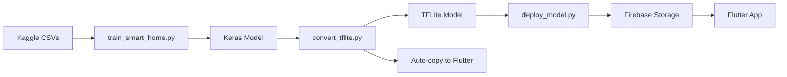

I'll help you fix the training script to use your Kaggle dataset and automate the file copying. Let me analyze your setup and provide a corrected solution.

## Analysis of Your Setup

Looking at your files, I can see:
1. You have Kaggle datasets in `ml/data/raw/` (HomeC.csv, aruba.csv, tulum.csv)
2. The training script needs to be updated to properly load and process these
3. The file copying should be automated

## Corrected Training Script## Complete Step-by-Step Execution Guide

Here's the **exact order** to run all scripts:

### **STEP 1: Train the Model** ✅
```bash
cd ml
python scripts/train_smart_home.py
```

**What it does:**
- ✅ Loads your Kaggle datasets (HomeC.csv, aruba.csv, tulum.csv)
- ✅ Converts to SmartSync format
- ✅ Creates hourly features
- ✅ Trains LSTM model
- ✅ Evaluates performance
- ✅ Saves model + scaler + metadata

**Output:**
- `ml/models/saved_models/schedule_predictor_v1/` (Keras model)
- `ml/data/processed/scaler.pkl`
- Training plots in `ml/models/saved_models/`

---

### **STEP 2: Convert to TFLite** 🔄
```bash
python scripts/convert_tflite.py
```

**What it does:**
- ✅ Converts Keras model to TensorFlow Lite
- ✅ Applies INT8 quantization
- ✅ Verifies model works
- ✅ **AUTOMATICALLY copies to Flutter assets** (no manual `cp` needed!)

**Output:**
- `ml/models/tflite/schedule_predictor.tflite`
- `app/assets/models/schedule_predictor.tflite` ← Auto-copied!

---

### **STEP 3: Deploy to Firebase** ☁️
```bash
python scripts/deploy_model.py
```

**Requirements:**
1. Download `serviceAccountKey.json` from Firebase Console
2. Place in `ml/` directory

**What it does:**
- ✅ Uploads TFLite model to Firebase Storage
- ✅ Updates Firestore with model metadata
- ✅ Makes model accessible to Flutter app

---

## Key Improvements in the Fixed Script

### 1. **Kaggle Dataset Loading**
```python
def load_kaggle_dataset():
    dataset_files = [
        RAW_DATA_DIR / "HomeC.csv",
        RAW_DATA_DIR / "aruba.csv",  
        RAW_DATA_DIR / "tulum.csv",
    ]
    # Automatically finds and combines all available datasets
```

### 2. **Smart Conversion Logic**
```python
def convert_to_smartsync_format(df):
    # Fan speed derived from temperature
    smartsync_df['fanSpeed'] = df['Temperature'].apply(
        lambda t: int(max(0, min(255, (t - 20) / 15 * 255))) if t > 24 else 0
    )
    
    # LED brightness derived from ambient light
    smartsync_df['ledBrightness'] = df['Light'].apply(
        lambda l: 255 if l < 200 else int(max(0, 255 - l / 4))
    )
```

### 3. **Automated File Copying**
```python
def copy_to_flutter_assets():
    """Replaces manual 'cp' command"""
    for tflite_file in TFLITE_DIR.glob('*.tflite'):
        shutil.copy2(tflite_file, APP_ASSETS / tflite_file.name)
```

This is called automatically in `convert_tflite.py`!

---

## Troubleshooting

### If no dataset files found:
```bash
# Make sure files are in ml/data/raw/
ls ml/data/raw/
# Should show: HomeC.csv, aruba.csv, tulum.csv
```

### If conversion fails:
```bash
# Ensure TensorFlow is installed
pip install tensorflow>=2.15.0
```

### If Firebase deployment fails:
1. Check `serviceAccountKey.json` exists
2. Verify Firebase project ID matches
3. Enable Cloud Storage in Firebase Console

---

## Summary: Complete Workflow



**Run these 3 commands in order:**
```bash
cd ml
python scripts/train_smart_home.py      # Train
python scripts/convert_tflite.py        # Convert + Auto-copy
python scripts/deploy_model.py          # Deploy
```

That's it! No manual file copying needed. Everything is automated! 🎉